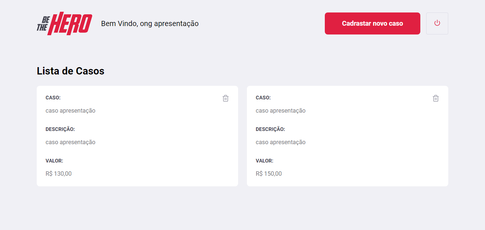
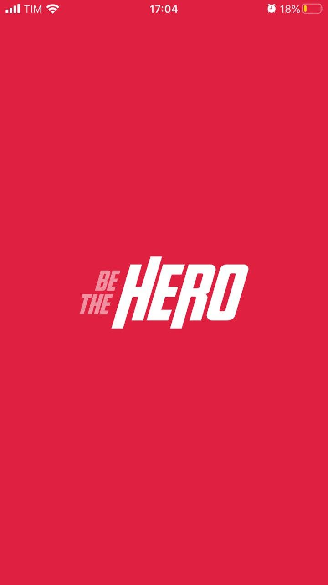
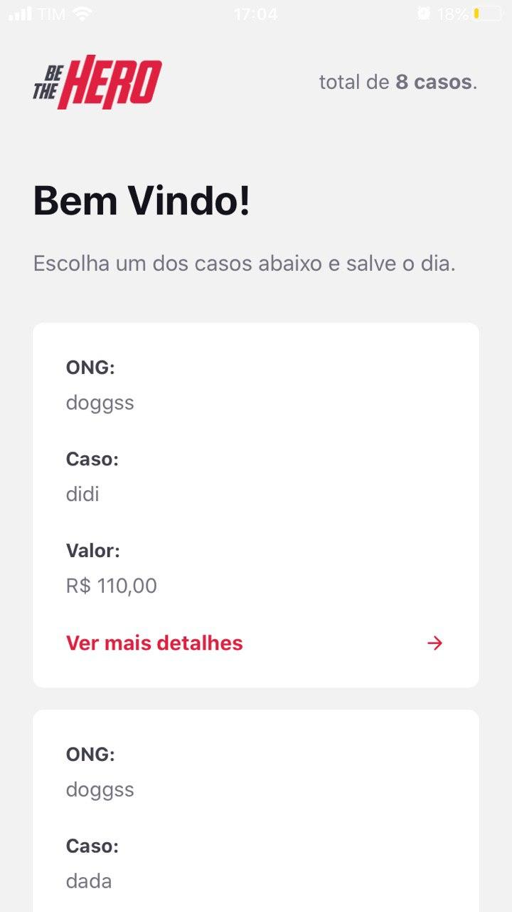

# Be The Hero
> Projeto construido junto a oministack 11, utilizando NodeJs, React e React-Native.

Be The Hero é uma aplicação que tem por objetivo principal ajudar ONGs a publicar seus casos por exemplo (um animal atropelado que nescessita de atemdimento medico e precisa de doações) assim a ONG vigente do caso pode divulga-lo e pode receber contado de varios "Heros", para receber doações monetarias ou não.

<p>link para live do frontend: <a href="url">https://practical-hopper-e584a2.netlify.com<a/> <p/>

<p>link para app no expo: <a href="url">https://expo.io/@walker665/betheheroproject<a/> <p/>





## Instalação

OS X & Linux & Windows:

```
npm install
```
# iniciar
```
npm start
```

## Aplicativo


 

